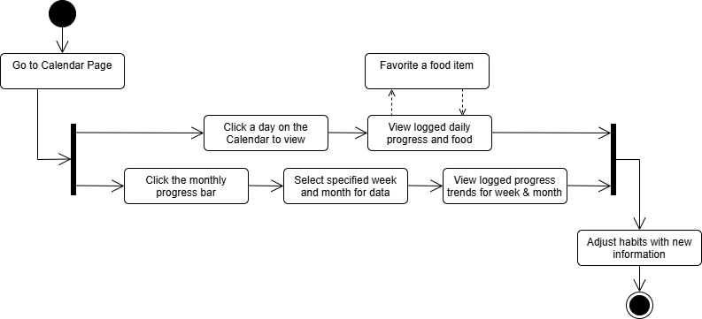

# Specification Phase Exercise

A little exercise to get started with the specification phase of the software development lifecycle. See the [instructions](instructions.md) for more detail.

## Team members

See instructions. Delete this line and replace with a list of the names of your team members, including links to each one's GitHub profile.

## Stakeholders

Forrest's roommate Johan, an NYU Alum and avid weightlifter was interviewed for his perspective on this application.

### Johan's Goals/Needs/Desires for Caloric Tracking App
- Simple and quick input of calorie intake
- Ability to input and log common items / regular meals
- No advertisements
- Measurable goals and goal progress

### Johan's Problems/Frustrations with current solutions
- It is difficult to log your caloric intake outside of bloated software with unnecessary paid functionality
- Input forms ask for too much non-essential information
- Additional functionality of calorie trackers does not add value to the experience, instead it disincentivizes use
- Basic calorie trackers do too little, advanced trackers do too much of the wrong thing. A healthy medium with basic functionality and genuinely useful functionality would go a long way to help

## Product Vision Statement

See instructions. Delete this line and place your Product Vision Statement here.

## User Requirements

### Meal and Recipe Tracking
- **Ingredient List Viewing:** As a user, I want to see the ingredient list of a specific dish, so I can track groceries for my meals.
- **Recipe Search:** As a user, I want to search for recipes using a search bar, so I can quickly find meals that match my preferences.
- **Recipe Filtering:** As a user, I want to filter recipes based on protein type, dietary restrictions, and meal categories, so I can easily discover recipes that fit my nutritional needs.
- **Favorite Recipes:** As a user, I want to save my favorite recipes, so I can easily access and plan balanced meals that fit my daily calorie goals.

### Community Features
- **Reading Articles:** As a user, I want to read the articles published by others in the community, so I can know how others keep track of their calorie intake and design their healthy meal plan.
- **Publishing Articles:** As a user, I want to publish articles on creating healthy meal plans, so I can share my experience and help others in the community.

### Personal Tracking and Progress
- **Profile Management:** As a user, I want to input, update, and view my profile information (such as name, weight, goal weight, and height) so that I can track my progress toward my target weight.
- **Meal Logging:** As a user, I want to log meals with calorie values so that I can track my daily intake.
- **Calorie Progress Bar:** As a user, I want to see a progress bar of my calorie intake so that I know how close I am to my daily goal.
- **Historical Log:** As a user, I want to see a historical log of my tracked calorie intakes so I know my health trends.
- **Health Goal Tracking:** As a user, I want to see the progress I am making towards my weekly, monthly, and yearly health goals.

## Activity Diagrams

### Health Goal Tracking UML Diagram
As a user, I want to see the progress I am making towards my weekly and monthly health goals, adjusting my habits accordingly.

## Clickable Prototype

See instructions. Delete this line and place a publicly-accessible link to your clickable prototype here.
