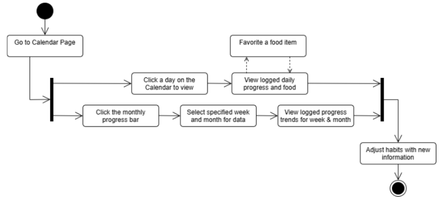
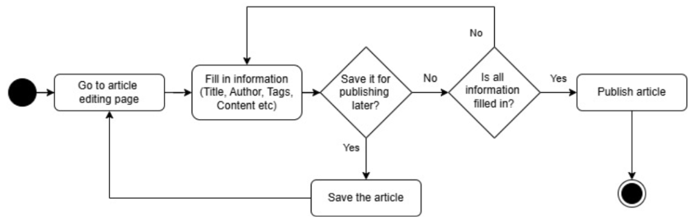

# Specification Phase Exercise

A little exercise to get started with the specification phase of the software development lifecycle. See the [instructions](instructions.md) for more detail.

## Team members

1. [Jasmeen Kaur](https://github.com/jk7297)
2. [Rin Qi](https://github.com/Rin-Qi)
3. [Kai-Hsuan Chan](https://github.com/shayne773)
4. [Forrest Williams](https://github.com/Zeklin)

## Stakeholders

Forrest's roommate Johan, an NYU Alum and avid weightlifter was interviewed for his perspective on this application.

### Johan's Goals/Needs/Desires for Caloric Tracking App

- Simple and quick input of calorie intake
- Ability to input and log common items / regular meals
- No advertisements
- Measurable goals and goal progress

### Johan's Problems/Frustrations with current solutions

- It is difficult to log your caloric intake outside of bloated software with unnecessary paid functionality
- Input forms ask for too much non-essential information
- Additional functionality of calorie trackers does not add value to the experience, instead it disincentivizes use
- Basic calorie trackers do too little, advanced trackers do too much of the wrong thing. A healthy medium with basic functionality and genuinely useful functionality would go a long way to help

## Product Vision Statement

FuelUp is a smart calorie tracking app that helps users monitor their daily intake while seamlessly integrating recipe recommendations, analytics-driven progress tracking using a calendar feature, and an article hub for nutritional insights and motivation.

## User Requirements

1. As a user, I want to input, update, and view my profile information (such as name, weight, goal weight, and height) so that I can track my progress toward my target weight.
2. As a user, I want to log meals with calorie values so that I can track my daily intake.
3. As a user, I want to see a progress bar of my calorie intake so that I know how close I am to my daily goal.
4. As a user, I want to search for recipes using a search bar, so I can quickly find meals that match my preferences.
5. As a user, I want to filter recipes based on protein type, dietary restrictions, and meal categories, so I can easily discover recipes that fit my nutritional needs.
6. As a user, I want to save my favorite recipes, so I can easily access and plan balanced meals that fit my daily calorie goals.
7. As a user, I want to see the ingredient list of a specific dish, so I can track groceries for my meals.
8. As a user, I want to read the articles published by others in the community, so I can know how others keep track of their calorie intake and design their healthy meal plan.
9. As a user, I want to publish articles on creating healthy meal plans, so I can share my experience and help others in the community.
10. As a user, I want to see a historical log of my tracked calorie intakes so I know my health trends.
11. As a user, I want to see the progress I am making towards my weekly, monthly, and yearly health goals, so that I can adjust my habits accordingly.

## Activity Diagrams

### Health Goal Tracking UML Diagram

As a user, I want to see the progress I am making towards my weekly and monthly health goals, so I can adjust my habits accordingly.

### Article Publishing UML Diagram

As a user, I want to publish articles about my experience on adjusting meal plans, so I can share my experience on it.

## Clickable Prototype

[Prototype](https://www.figma.com/proto/99YUc75ACVyAV0f16Hv84x/Pixelated?node-id=28-2&p=f&t=4cnw76sb9qU83dWv-1&scaling=scale-down&content-scaling=fixed&page-id=0%3A1&starting-point-node-id=27%3A2)
